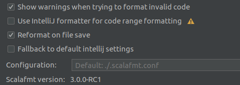

[](https://github.com/fedor-malyshkin/coding-scala-books/actions/workflows/ci.yml)

# coding-scala-books

Some exercise in Scala (based on books related to Scala)

## Requirements

* NONE

## Books

* [Functional Programming in Scala](https://www.manning.com/books/functional-programming-in-scala) _("fpinscala" package)_
* [Scala with Cats 2](https://www.scalawithcats.com/) _("underscore.cats" package)_
* [Functional and Reactive Domain Modeling]()
* [Reactive Design Patterns]()
* [Reactive Messaging Patterns with the Actor Model]()

## Run tests

```sh
./gradlew test
```

## Code formatting

I use `scalafmt` (IDE settings + gradle's plugin to start it)

#### Good references worth to check
* [Twitter’s Effective Scala](http://twitter.github.io/effectivescala/) <-- more Scal'ish
* [Databricks Scala Guide](https://github.com/databricks/scala-style-guide) <-- less Scal'ish
* [The Official Scala Style Guide](http://docs.scala-lang.org/style)

I use such settings:


since it looks like IntelJ too often use its own formatter instead `scalafmt` to optimise performance that could easily cause different results.
